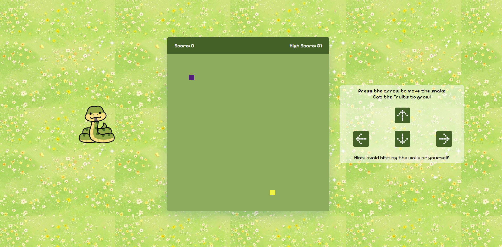
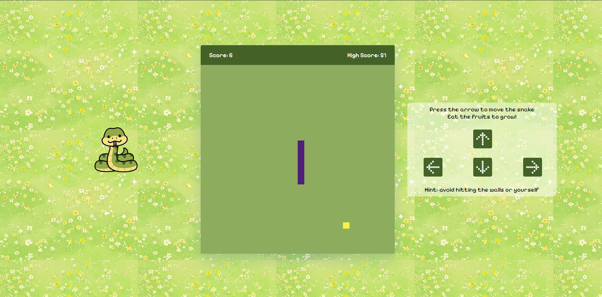
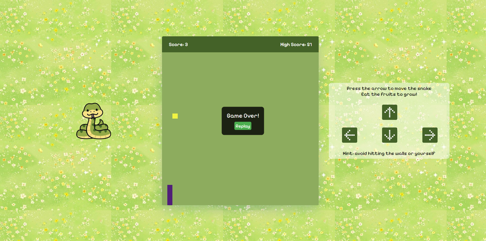

# Browser-Based-Snake-Game-Project 

You can play the game here: https://btlsharf.github.io/Browser-Based-Snake-Game-Project/

# Game Demo

# Technologies Used
- HTML
- CSS
- Javascript

# Requirements
- the snake starts on the left-middle side
- the snake is initialy 4 boxes long
- the score (number of fruits eaten) is shown in the header
- the highest score (highest number of fruits eaten) is shown in the header
- the snake moves 1 box every second in the dircetion it is currently in
- there is a fruit the snake is supposed to 'eat'
- the snake grows a box longer when eating the fruit
- another fruit appears on a random empty box when the snak eats the fruit
- the snake loses when it hits the border or itself

# Strat Game 
- initially the screen shows a "start game button" 
- the game takes 2 second to start before the snake starts moving

# Upper header
- Score: keeping score of how many fruits the snake ate

# Future Improvements
- change the color of the snake
- black mode
- change the fruit
- add music
- add crash sound & losing sound
- difficulty levels (how fast  the snake moves)

# Variables
- board: array of array to represent the board, boxes the snake can move in
- score: number of fruits eaten
- direction: direction the snake is currently going
- timer: moving the snake per second
- lenght: lenght of snake, intially 4, incremneted with each fruit

# methods
- check valid box
- change direction
- add score
- is game over
- 

# Resources 
- W3Schools: https://www.w3schools.com/
- Youtube tutorial by AsmrProg: https://youtu.be/wM7eMJ26kc8
